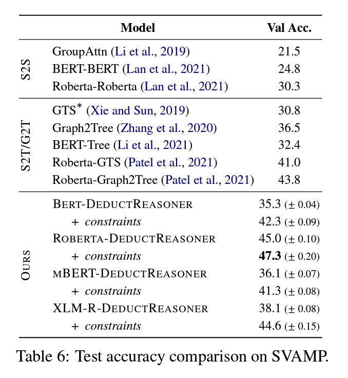
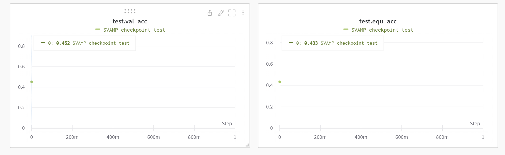
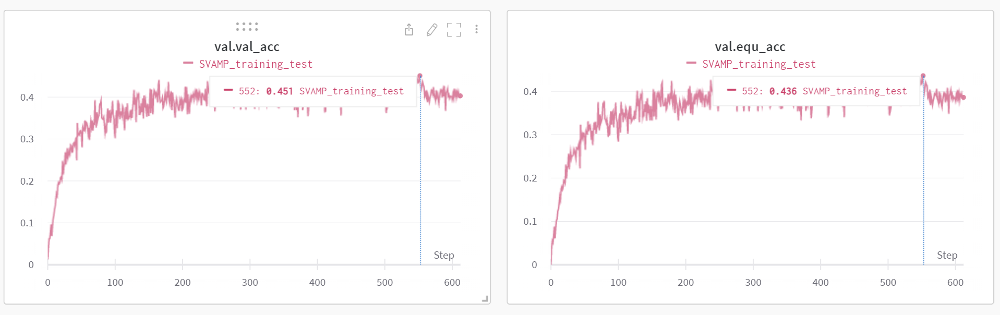
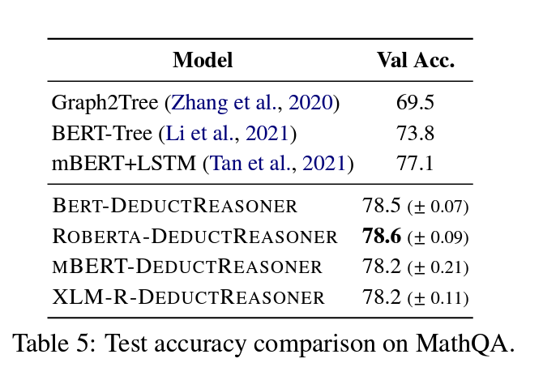
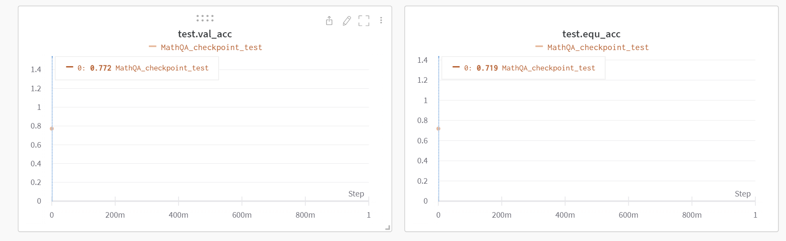

# 220707

 

## 오전 7시 - 오전 11시 30분

 

1. mBERT+LSTM
- [x] GPU server rebooting
- [x] docker port 번호 받기 (필요없는 걸 확인함)
- [x] docker container 새로 생성
- [x] docker container train.sh 돌리기
    + dockerfile 과 호환이 잘 되지 않아서 환경 설정중
    + WARNING - root - Torch AMP is not available on this platform
- [ ] docker 실행 방식에 문제가 있음.
    + bash script 말고는 실행 방법이 없는데, 이상함.
    + PyTorch 와 allennlp 안에 있는 fairscale 버전이 매우 다른데, 맞출 방법이 없음...

2. DeductiveReasoner
- [x] SVAMP train script 결과 확인
- [x] MathQA checkpoint 사용 -> 성능 측정

 

----

## DeductiveReasoner

 

### [SVAMP]

 

||paper|checkpoint|training|
|:-:|:-:|:-:|:-:|
|val_acc|47.3 (± 0.20)|45.2|45.1|
|equ_acc|결과없음|43.3|43.6|

 

- 논문 성능: 47.3 (± 0.20)

 

- 실제 성능 - checkpoint: 45.2 (val_acc), 43.3 (equ_acc)

 

- 실제 성능 - checkpoint: 45.1 (val_acc), 43.6 (equ_acc)

 

 

### [MathQA]

 

| |paper|checkpoint|training|
|:-:|:-:|:-:|:-:|
|val_acc|78.6 (± 0.09)|77.2|결과없음|
|equ_acc|결과없음|71.9|결과없음|

 

- 논문 성능: 78.6 (± 0.09)

 

- 실제 성능 - checkpoint: 77.2 (val_acc), 71.9 (equ_acc)
- (training 은 130 ~ 170 시간 소요되므로, 우선순위에서 제외시킴.)

 

## 오후 1시 - 5시

 

1. 현황 공유 및 회의 준비

- mBERT-LSTM 라이브러리 호환 문제로 내일까지 작성하기로 함.

- MWPToolkit 에서 mathqa -> 새로 training tool 을 작성중이며, 내일까지 공유해보기로 함.

- 데이터 분포, 현재까지 모델 성능 작성 (공유폴더/미팅자료/20220707.pptx)

- 간담회 질문 사항 정리
    + 1. 난이도 분포에 관하여
    + 2. GPU 메모리 용량
    + 3. 시간 문항에 관하여 정답 형식이 기존과 다른지, 다르다면 어떻게 다른지에 대해

- 5차_2단계 데이터 공유

 

2. 논문 속독 및 자료 추가

- [Investigating Math Word Problems using Pretrained Multilingual Language Models](https://arxiv.org/pdf/2105.08928.pdf)
- 논문 요약 공유 (공유폴더/미팅자료/20220707.pptx)

3. 데이터 난이도 1 정답 작성 완료

 

## 오후 5시 - 7시

 

1. 주간 세미나

- [bilateral self-unbiased recommender learning from biased implicit feedback](http://www.joonseok.net/papers/biser.pdf)
- [Introducing Neural Bag of Whole-Words with ColBERTer: Contextualized Late Interactions using Enhanced Reduction](https://arxiv.org/pdf/2203.13088.pdf)
- 마음가짐과 태도에 관하여