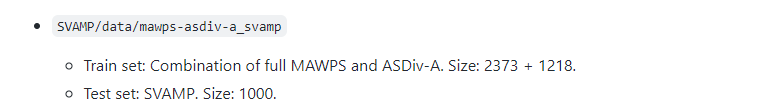

## 220712

 

## 오전 9시 - 오후 1시

 

1. mBERT+LSTM 구현
- framework 연결
- 코드 일부 수정
- wandb 설정 완료
- 학습 4시간 소요 예정

 

## 오후 1시 30분 - 오후 2시 40분

 

1. mBERT+LSTM 수정
- 터미널이 멈춰서 다시 학습중
- false 만 나타나는 error 수정

2. 현황 공유
- 데이터 계획 작성을 위한 20, 21년 수집 및 증강 현황을 공유받음.
- wandb 사용법 공유

3. SVAMP 구현 역할 담당

- [SVAMP](https://github.com/arkilpatel/SVAMP) data 적용

## 오후 3시 - 6시, 9시 - 12시

1. SVAMP 적용
- framework 가 상당히 꼬여 있음...
- train: Numbers 가 있고, 문제는 number0 로 치환되어 있음. equation 이 이미 치환되어 있고, 전위 표기법이라 편함.
- valid: question 에 숫자가 그대로 있음. equation 이 숫자로 되어 있고 중위 표기법이라 변경해야 했음.
- 다 적용해서 변경까지 했으나, 식의 결과값을 이용하는 # 에 대한 처리는 하지 못함.
- 돌려본 결과, 성능이 20 % 를 겉돈다.

2. valid_loss 생성
- 학습이 overfitting 되는지 보려면, 반드시 필요한데 구현되어 있지 않음.
- 내일 이야기해서 구현해볼 필요가 있을 것 같다.
